# Calcification

## 要求5

> 判断结节内部是否存在结晶或者钙化

### 背景介绍
- **结晶**：结节内的白色颗粒物，形似豆子，带有结晶的结节大概率为良性结节。结晶内部通常呈现出一定程度的强声反射，回声强度较高。
  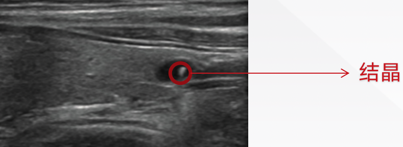

- **钙化**：钙化在超声影像中以高亮点显示，可发生在结节内或结节外。其有多种类型。
  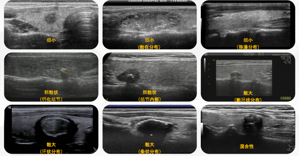

### 实现方法

1.结节区域提取：使用结节mask提取结节区域

2.训练 SVR 模型，建立结晶、钙化特征与灰度阈值之间的关系

+ 数据预处理：读取图像、提取特征和对应的灰度阈值标签，保存为NumPy数组，以便后续机器学习的训练

+ 模型训练：通过训练 SVR 模型，建立了特征与灰度阈值之间的关系，并保存训练好的模型用于实际应用

+ 灰度阈值预测：在实际应用中，调用训练好的模型预测结晶、钙化的灰度阈值，以便后续阈值处理

3.判断结晶钙化是否存在：根据上述灰度阈值对结节图像进行二值化阈值处理，计算二值化图像中非零像素的个数，即结晶或钙化区域的像素个数。根据结晶或钙化区域的像素个数进行判断：如果像素个数大于0，则存在结晶或钙化，否则结晶、钙化不存在

4.区分结晶与钙化：根据医疗资料可知无回声的结节（即囊性结节）中出现细小强回声可视为结晶，其余视为钙化。 调用结节内质分类的模型，得到结节内质分类。根据结节是否是囊性结节以及结节内部结晶钙化情况判断：如果结节是囊性结节且内部存在高回声区域，则存在结晶；否则结节内的高回声区域为钙化

### 实现效果
- **结晶**：

  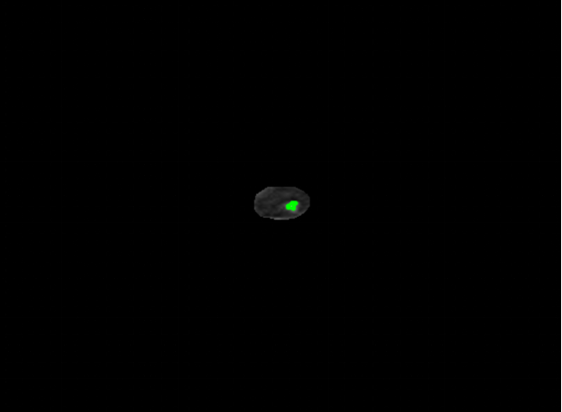

- **钙化**：

  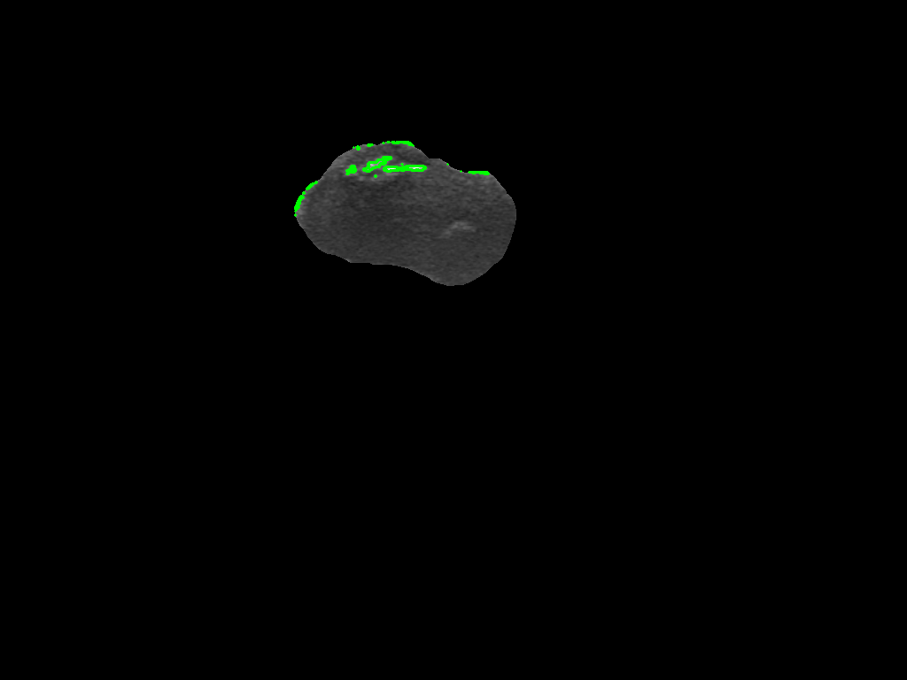

- **无结晶钙化**：

  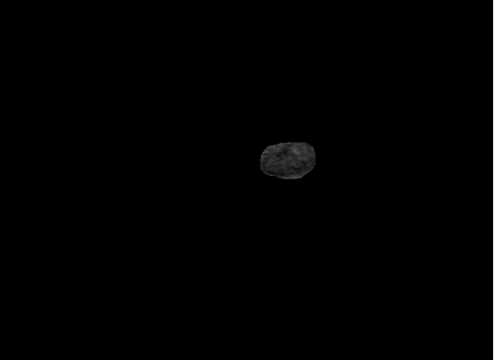

## 要求6

> 在甲状腺内寻找钙化位置

### 背景介绍
甲状腺内钙化可以出现在甲状腺的不同位置，具体位置取决于钙化的原因和甲状腺内的病变。

### 实现方法

1.甲状腺区域提取：使用甲状腺mask提取甲状腺区域

2.钙化灰度阈值确定：调用训练好的模型预测钙化的灰度阈值，以便后续阈值处理

3.钙化区域确定：根据钙化阈值得到钙化区域的二值图像，寻找钙化区域的轮廓，绘制钙化区域的轮廓。

### 实现效果
  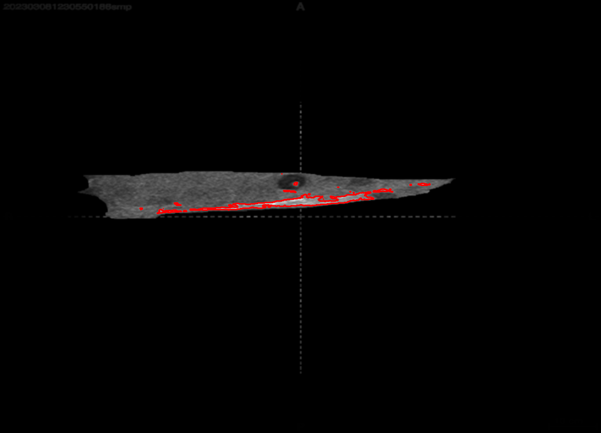

  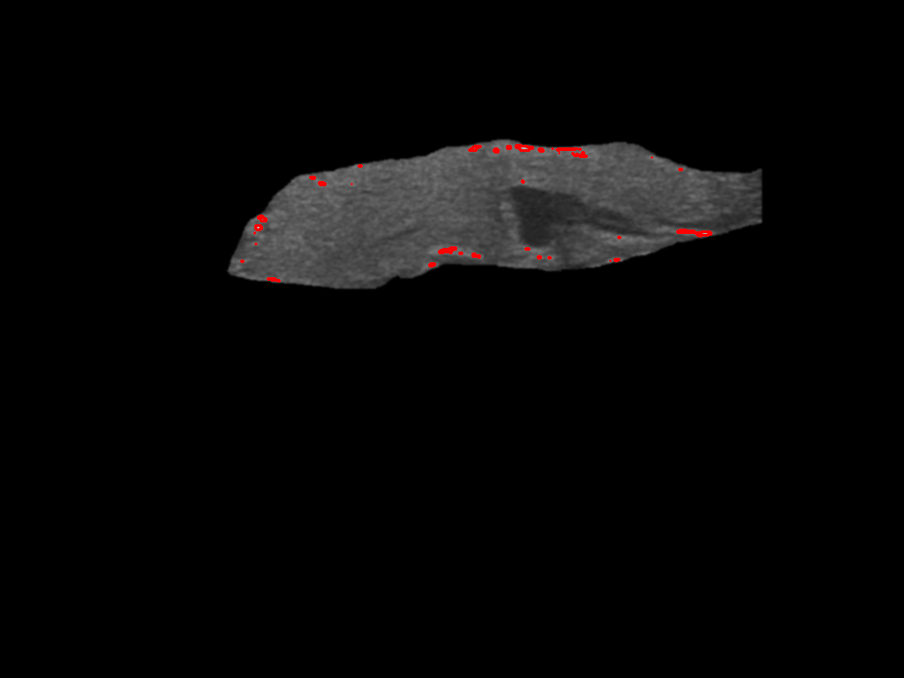

## 要求10

> 判断结节的声晕厚度

### 背景介绍
结节声晕是指结节周围环绕的低回声区或无回声区。

病理机制是甲状腺结节快速增长过程中结节周围的正常组织、纤维组织和血管等受到结节的挤压而导致。

研究认为良性结节的声晕往往连续、完整、清晰、均匀的薄光环，恶性肿瘤的声晕往往增厚、缺失、不连续、不均匀，最常见的乳头状癌声晕通常厚薄不均。

### 实现方法
1.计算结节边缘图像的质心

2.结节边缘的每个边缘点向外检测声晕是否存在：检测当前坐标对应的图像灰度值是否小于灰度阈值，如果小于则继续向外更新坐标，否则该边缘点的声晕检测结束。

3.计算存在声晕部分的声晕平均厚度

### 实现效果
  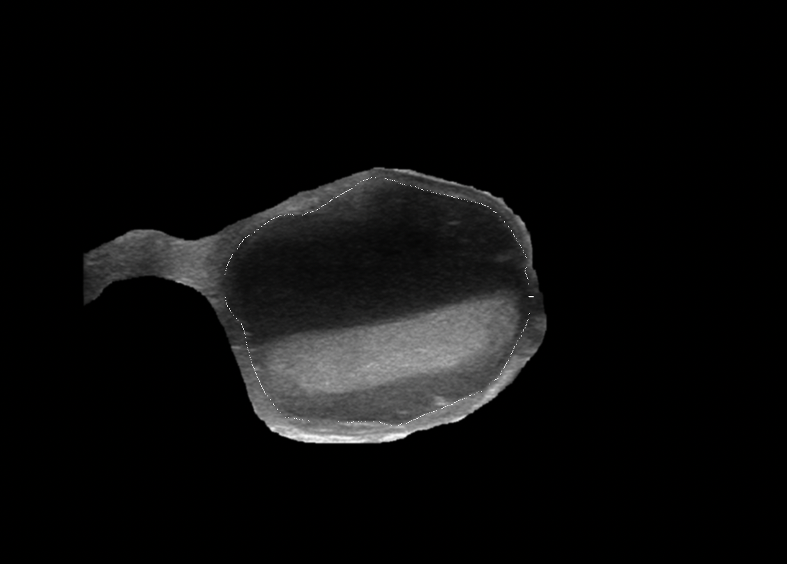

  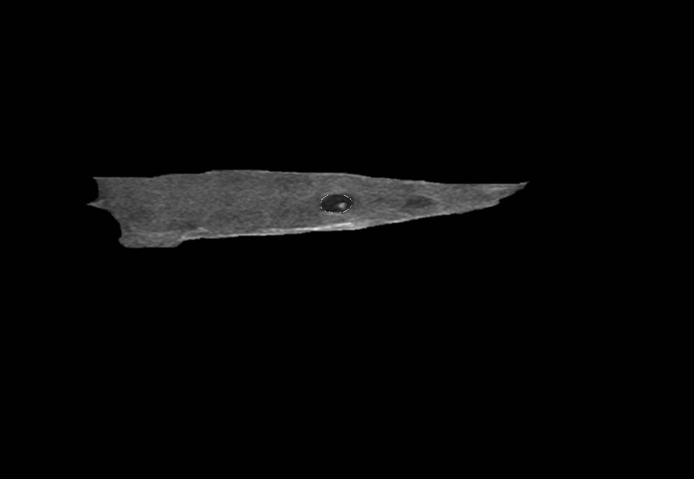

## 要求12

> 对甲状腺内钙化位置的情况进行分类

### 背景介绍
根据钙化的大小、形态和分布特征分类，钙化可分为微钙化、粗钙化、边缘钙化、环状钙化、间断钙化等多种类型。

结节内出现任意类型的钙化，患癌的风险性均增加，以微钙化恶性危险性最大。

### 实现方法
1.甲状腺区域和结节边缘提取：使用甲状腺mask提取甲状腺区域，使用结节mask提取结节边缘

2.钙化灰度阈值确定：调用训练好的模型预测钙化的灰度阈值，以便后续阈值处理

3.钙化分类： 

+ 首先判断钙化区域与结节轮廓的关系，判断钙化区域是在结节内部、与结节相交还是在结节外部
+ 进一步根据钙化特征判断钙化区域的形状 
  + 结节内部：
    + 使用图像腐蚀等方法判断斑点状钙化：二值湖斑点钙化
    + 使用阈值分析判断高回声钙化：明亮钙化
    + 根据钙化轮廓的曲率和长度宽度比特征判断是否存在弧形：弧形钙化
  + 结节边缘：
    + 根据钙化轮廓的凸包面积比和曲率特征判断边缘钙化的形状是环状、弧形、点状
  + 结节外部：
    + 根据钙化轮廓的凸包面积比和曲率特征判断外部钙化的形状，无法拟合椭圆的为点状，其余则根据面积比和曲率的判断结果划分为环状、弧形或点状
+ 使用不同颜色标记不同的钙化种类

### 实现效果
  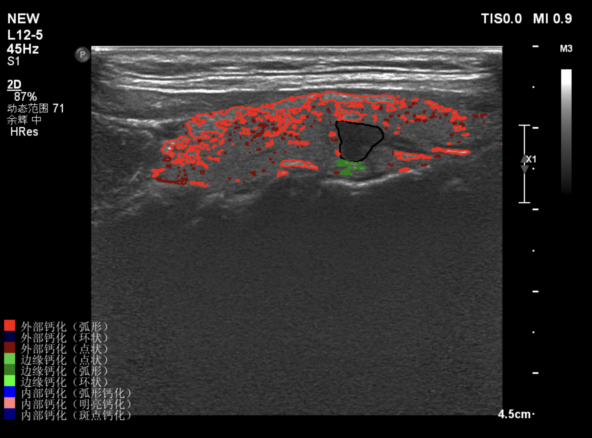

  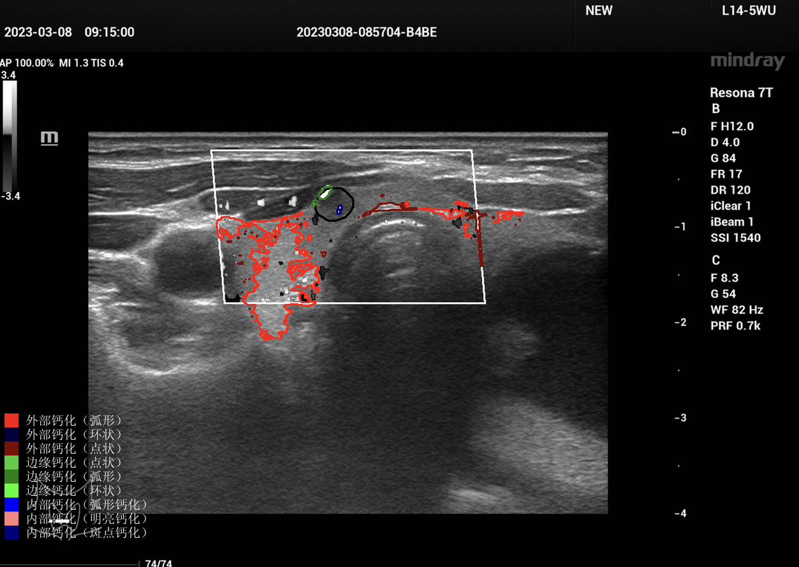
  
  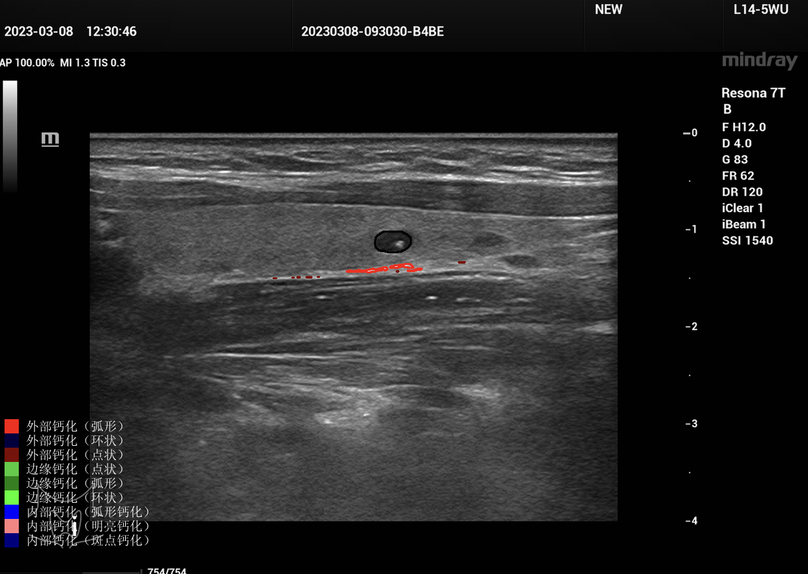