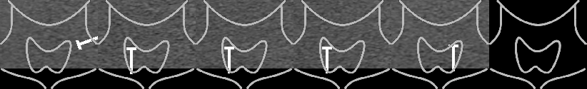

# frontend

- [frontend](#frontend)
  - [要求1](#要求1)
    - [模型](#模型)
      - [模型结构](#模型结构)
      - [模型细节](#模型细节)
    - [训练](#训练)
      - [预处理](#预处理)
      - [学习率](#学习率)
  - [要求2](#要求2)
  - [要求7](#要求7)

文档描述了项目[frontend](https://github.com/Zhang-ycc/CV-Project/tree/frontend)分支中实现的三项功能的具体实现方式。

## 要求1

> 先提取甲状腺前景图像并根据打点标记获取病灶ROI

多数图片不存在打点标记，且部分打点标记模糊，不易识别，因此考虑直接使用神经网络模型[nnUNet](https://github.com/MIC-DKFZ/nnUNet)完成所有的分割任务。

### 模型

#### 模型结构

模型在UNet的基础上进行改进，先逐层进行下采样，然后逐层进行上采样，其中上采样还使用了下采样过程中得到的feature信息，因此只介绍模型在下采样和上采样过程中进行的设计。

下采样层的结构为

```txt
DownSampleBlock
├── Conv2d    kernel_size=[3, 3] stride=[2, 2]
├── InstanceNormalization
├── LeakyReLU
├── Conv2d    kernel_size=[3, 3] stride=[1, 1]
├── InstanceNormalization
└── LeakyReLU
```

上采样层的结构为

```txt
MiddleBlock
├── Concat
├── Conv2d    kernel_size=[3, 3] stride=[1, 1]
├── InstanceNormalization
├── LeakyReLU
├── Conv2d    kernel_size=[3, 3] stride=[1, 1]
├── InstanceNormalization
├── LeakyReLU
└── ConvTranspose2d    kernel_size=[2, 2] stride=[2, 2]
```

考虑到显存、运行效率与运行效果等，模型为6层的UNet。

#### 模型细节

其中，Instance Normalization（IN）是对单个channel进行归一化的方法，其计算方法为

$$
\begin{aligned}
\mu_{ti}&=\frac1{HW}\sum_{l=1}^W\sum_{m=1}^Hx_{tilm}\\
\sigma_{ti}^2&=\frac1{HW}\sum_{l=1}^W\sum_{m=1}^H(x_{tilm}-\mu_{ti})^2\\
y_{tijk}&=\frac{x_{tijk}-\mu_{ti}}{\sqrt{\sigma_{ti}^2+\epsilon}}
\end{aligned}
$$

LeakyReLU是激活函数ReLU的变体，其公式为

$$
\text{LeakyReLU}(x)=
\begin{cases}
x,& x\geq0\\
\alpha x,& \text{otherwise}
\end{cases}
$$

其中$\alpha$是一个小于$1$的正数，通常为$0.01$。

### 训练

#### 预处理

根据下发的第一组文件全集进行k-fold训练。下发文件中已标记出结节位置信息，甲状腺位置由人工标注完成，最终整合为`.png`格式的标签文件，标签文件中的灰度数值表示分割分类：

- **0**：背景部分
- **1**：甲状腺非结节部分
- **2**：甲状腺结节部分

考虑到`.dcm`文件图像中的文字信息易于分割，对模型学习的影响不大，且图像部分大小不一难以分割，因此没有对图像进行进一步处理，仅将其转为灰度图。

#### 学习率

训练时的学习率从$0.01$线性降低到$2\times10^{-5}$。

## 要求2

> 根据打点距离信息计算ROI大小、结节的上下径、前后径、左右径

在[要求1](#要求1)中获取到了结节区域，作为ROI大小的参照。

图像的物理距离通过读取`.dcm`文件的元数据部分获取，参考[DICOM Standard Browser](https://dicom.innolitics.com/ciods)文档信息得知图像的单个像素真实物理长度存储在相应的元数据中：

| tag | KeyWord | Description |
|:--:|:--:|:--|
| (0018,602C) | Physical Delta X | The physical value increments per positive X pixel increment. |
| (0018,602E) | Physical Delta Y | The physical value increments per positive Y pixel increment. |

再根据分割结果的长宽像素点数量，计算ROI大小。

由于作业中提供的超声图像并不是横扫-竖扫成对出现，因此不能获取得到完整的ROI三维大小信息，仅能获取二维大小数据。

## 要求7

> 依照图像右下角位置信息和图像呈现的内容判断当前图像的取材位置信息（包括图像的位置、角度信息，病灶区域周围组织有哪些，结节长轴是否平行于皮肤等）

图像中的位置信息图标依照超声机器的不同共有两类，考虑均从图像中裁取这一部分图标。第一类图标获取较为容易，可以方便地找到两幅图像，其图标部分底部均为黑色，一幅图像的扫描头为左侧竖扫，另一幅为右侧竖扫，因此可以左右拼接两个图标得到背景为黑色、无扫描头的图标图像；第二类图标背景均有灰度超声图像信息，考虑选取多幅背景不同的图像做与操作，最终得到背景为黑色的图标图像。



获取取材位置信息的算法流程为：

1. 将两幅图标图像在超声图像中做匹配，获取匹配结果最好的图像部分内容；
2. 对匹配部分做二值化以获取高亮度的扫描头。由于扫描头可能被图标部分覆盖，同时第一类图像中的扫描头为小写字母i型，因此扫描头部分可能不连通，使用形态学闭操作将其连通；
3. 对扫描头做最小矩形包围，判断这一矩形的角度与长宽大小关系，从而判断图像为横扫、竖扫或是斜着扫。
